<div align="center">

<!-- HERO: custom animated SVG — stadium lights, speed trail, bicycle-kick silhouette -->


<h1>VIJAYARAGHAVAN S</h1>


<br/><br/>


</div>


## &nbsp;&nbsp;⚡ DEVELOPER PROFILE

<table align="center">
<tr>
<td>

```yaml
NAME     : Vijayaraghavan S
HANDLE   : vijay2git
ROLE     : AI/ML Developer • Full-Stack Developer • Freelancer
LOCATION : Tamil Nadu, India
STATUS   : Building 🟢
MOTTO    : carpediem!!
```

</td>
</tr>
</table>


## &nbsp;&nbsp;🛠 MY PLAYING XI — TECH STACK

> ⚠️ **Note:** I only have confirmed evidence of a handful of your repos (SimpleNntp, streamlit-rag, chromadb-rag, bday-19) from the screenshot you shared. The rest below are placeholders — send your full repo list and I'll replace `<...>` with your real stack instead of guessing.

<table align="center">
<tr>
<td valign="top" width="25%">

**FRONTEND**
<br/>
`<confirm your stack>`

</td>
<td valign="top" width="25%">

**BACKEND**
<br/>
Java • MySQL
<br/>
`<confirm more>`

</td>
<td valign="top" width="25%">

**AI / ML**
<br/>
Streamlit • RAG
<br/>
ChromaDB

</td>
<td valign="top" width="25%">

**TOOLS**
<br/>
Git • GitHub
<br/>
`<confirm more>`

</td>
</tr>
</table>


## &nbsp;&nbsp;⚡ MATCH HIGHLIGHTS — PROJECTS

<table align="center" width="90%">
<tr>
<td>

**⚡ HIGHLIGHT #01 — SimpleNntp**
<br/>
A simple NNTP-based prototype using MySQL and Java
<br/>
`Java` `MySQL`
<br/>
[VIEW PROJECT →](https://github.com/vijay2git/SimpleNntp)

</td>
</tr>
<tr>
<td>

**⚡ HIGHLIGHT #02 — chromadb-rag**
<br/>
`<add a one-line description>`
<br/>
`ChromaDB` `RAG`
<br/>
[VIEW PROJECT →](https://github.com/vijay2git/chromadb-rag)

</td>
</tr>
<tr>
<td>

**⚡ HIGHLIGHT #03 — streamlit-rag**
<br/>
`<add a one-line description>`
<br/>
`Streamlit` `RAG`
<br/>
[VIEW PROJECT →](https://github.com/vijay2git/streamlit-rag)

</td>
</tr>
</table>


## &nbsp;&nbsp;📊 CAREER STATS

<div align="center">


</div>


## &nbsp;&nbsp;🏋️ CURRENTLY TRAINING

```text
→ Retrieval-Augmented Generation systems
→ Full-stack architecture
→ Production-ready AI/ML pipelines
→ <add your real focus areas>
```


<div align="center">

## &nbsp;&nbsp;🎯 MINDSET

> **Talent gets you started. Discipline keeps you building.**

<br/>

## 📫 CONTACT

[](https://github.com/vijay2git)
[](http://vijaycr-nac.caffeine.xyz)

<br/>


</div>
