<div align="center">



# VIJAYARAGHAVAN S

### AI/ML DEVELOPER · FULL-STACK DEVELOPER · FREELANCER

**BUILD. GRIND. REPEAT.**

*Inspired by the mentality of elite performance — not a likeness, not an imitation.*

<br/>


&nbsp;


</div>


## THE MENTALITY

> **Discipline over motivation. Precision over noise. Consistency over shortcuts.**

I'm a student developer building across **AI/ML, full-stack engineering and product interfaces**, while taking on freelance work and turning experiments into working systems.

<div align="center">

`DISCIPLINE` &nbsp; `PRECISION` &nbsp; `SPEED` &nbsp; `EXECUTION`

</div>


## THE ARSENAL

<table align="center">
<tr>
<td width="33%" valign="top">

### FRONTEND

`Next.js`  
`React`  
`TypeScript`  
`Tailwind CSS`  
`Vite`  
`Framer Motion`  
`shadcn/ui`

</td>
<td width="33%" valign="top">

### BACKEND + AI

`Python`  
`FastAPI`  
`Flask`  
`Node.js`  
`RAG`  
`ChromaDB`  
`Streamlit`

</td>
<td width="33%" valign="top">

### CLOUD + TOOLS

`Docker`  
`Supabase`  
`Firebase`  
`Vercel`  
`Netlify`  
`Git`  
`GitHub`  
`Ollama`

</td>
</tr>
</table>


## THE WORK

### 01 — SimpleNntp

A Java + MySQL NNTP prototype.

`Java` `MySQL`

[VIEW PROJECT →](https://github.com/vijay2git/SimpleNntp)

---

### 02 — ChromaDB RAG

Retrieval-augmented generation experimentation using ChromaDB.

`Python` `RAG` `ChromaDB`

[VIEW PROJECT →](https://github.com/vijay2git/chromadb-rag)

---

### 03 — Streamlit RAG

Interactive RAG experimentation environment.

`Python` `Streamlit` `RAG`

[VIEW PROJECT →](https://github.com/vijay2git/streamlit-rag)


## PERFORMANCE

<div align="center">


<br/>


</div>


## CURRENT GRIND

```text
AI / ML             ████████████████████░░
FULL-STACK          ██████████████████░░░░
PRODUCT UI          ████████████████░░░░░░
FREELANCE           ███████████████░░░░░░░
```

**Currently sharpening:**
- Retrieval-Augmented Generation systems
- Production-oriented full-stack architecture
- AI/ML application pipelines
- Interactive UI and motion design
- Real client projects


<div align="center">

## NEXT LEVEL

**No shortcuts. Just better execution.**

<br/>

[](https://github.com/vijay2git)
[](http://vijaycr-nac.caffeine.xyz)

<br/><br/>

`KEEP BUILDING.`

</div>
